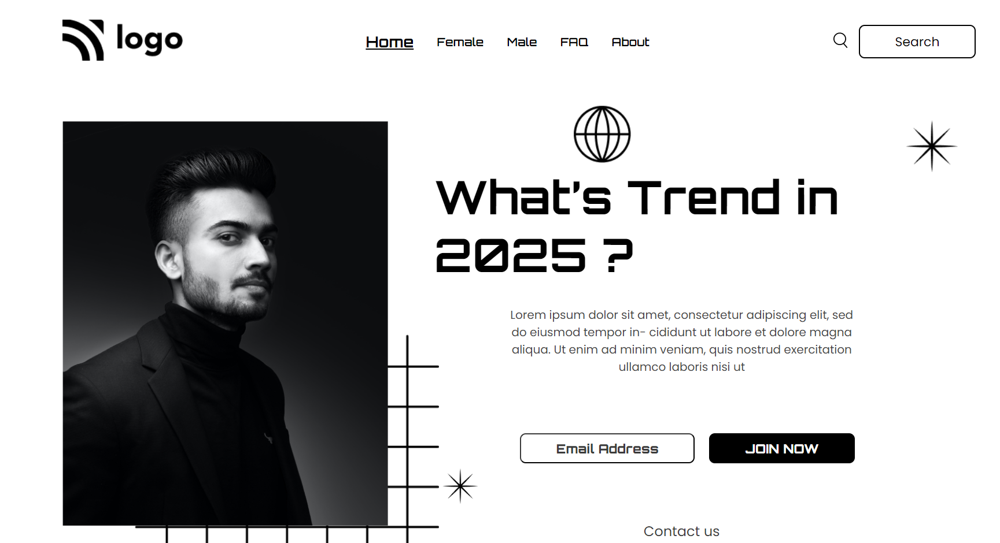

# Assignment 1

[Live Link](https://1-assignment.netlify.app/)

- Skills Gained

  - Learnd to use css position [Relative & Absolute] property.

---

## Time taken to finish this project

- 4 hour to complete it.

#### Screenshot

